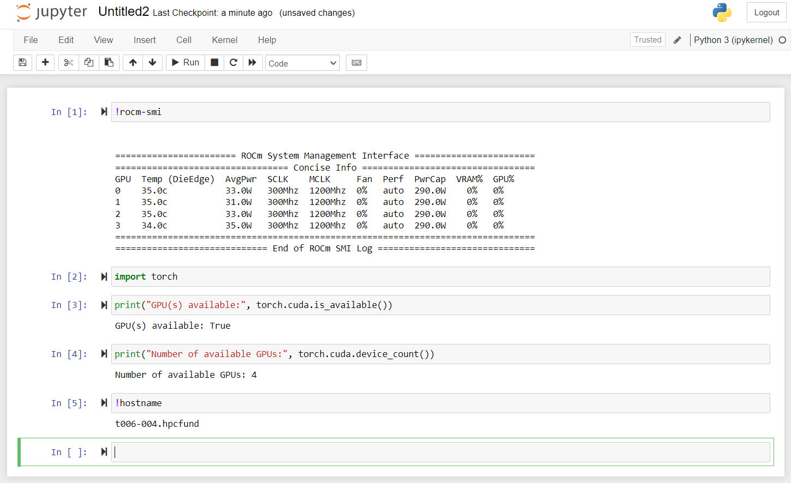

# Running Jobs

The HPC Fund Research Cloud runs the [SLURM](https://slurm.schedmd.com/overview.html) workload resource manager in order to organize job scheduling across the cluster. In order to access back-end compute resources, users must submit jobs to SLURM (either interactive or batch) and the underlying scheduler will manage execution of all jobs using a [multi-factor](https://slurm.schedmd.com/priority_multifactor.html) priority algorithm.

Multiple partitions (or queues) are available for users to choose from and each job submission is associated with a particular partition request.  The table below summarizes available production queues and runlimits currently available:


```{table} Table 1: Available SLURM queues
:name: table-queues
| Queue     | Max Time | Max Node(s) | Charge Multiplier |                Configuration                 |
| --------- | :------: | :---------: | :---------------: | :------------------------------------------: |
| `devel`   | 30 min.  |      1      |        1X         | Targeting short development needs (4xMI100). |
| `mi1004x` | 24 hours |     16      |        1X         |       4 x MI100 accelerators per node.       |
| `mi1008x` | 24 hours |      4      |       1.7X        |       8 x MI100 accelerators per node.       |
```

Note that special requests that extend beyond the above queue limits may potentially be accommodated on a case-by-case basis.

## Batch job submission

Example SLURM batch job submission scripts are available on the login node at `/opt/ohpc/pub/examples/slurm`.  A basic starting job for MPI-based applications is available in this directory named `job.mpi` and is shown below for reference:

```
#!/bin/bash

#SBATCH -J test               # Job name
#SBATCH -o job.%j.out         # Name of stdout output file (%j expands to jobId)
#SBATCH -N 2                  # Total number of nodes requested
#SBATCH -n 8                  # Total number of mpi tasks requested
#SBATCH -t 01:30:00           # Run time (hh:mm:ss) - 1.5 hours
#SBATCH -p mi1004x            # Desired partition

# Launch an MPI-based executable

prun ./a.out
```

The `prun` utility included in the above job script is a wrapper script for launching MPI-based executables. To submit this batch job, issue the command: `sbatch job.mpi`.  Note that in this example, 8 MPI tasks will be launched on two physical nodes resulting in 4 MPI tasks per node. This is a fairly common use case for the `mi1004x` partition where 1 MPI task is allocated per GPU accelerator.

```{tip}
SLURM batch submission scripts are just shell scripts - you can customize the script to perform various pre and post-processing tasks in addition to launching parallel jobs.
```

## Interactive usage
In addition to running batch jobs, you may also request an interactive session on one or more compute nodes.  This is convenient for longer compilations or when undertaking debugging and testing tasks where it is convenient to have access to an interactive shell.  To submit interactive jobs, the `salloc` command is used and the example below illustrates an interactive session submitted to the devel queue:

```{code-block} console
[test@login1 ~]$ salloc -N 1 -n 4 -p devel -t 00:30:00
salloc: ---------------------------------------------------------------
salloc: AMD HPC Fund Job Submission Filter
salloc: ---------------------------------------------------------------
salloc: --> ok: runtime limit specified
...
...
salloc: Granted job allocation 449
[test@t004-002 ~]$
```
When the above command is submitted on the login node, SLURM will queue the job and the prompt will temporarily hang until adequate resources are available. Once the scheduler has allocated resources,  your prompt will be updated to provide a login on the first assigned compute node. From here, you can run any shell commands until the maximum job runlimit is reached.  You can also launch parallel jobs interactively from within your allocation, for example:

```{code-block} console
[test@t004-002 ~]$ prun hostname
[prun] Master compute host = t004-002
[prun] Resource manager = slurm
[prun] Launch cmd = mpirun hostname (family=openmpi4)
t004-002.hpcfund
t004-002.hpcfund
t004-002.hpcfund
t004-002.hpcfund
```

```{tip}
To terminate an interactive job, simply type `exit` at your shell prompt.
```


## Compute node access
HPC Fund compute nodes are allocated in an **exclusive** fashion such that only a single user is on a node at any one time and is allocated all resources associated with the host (CPUs, host memory, GPUs, etc). Consequently, ssh access to back-end compute hosts are dynamically controlled with temporary access granted for the duration of a user's job.  The `squeue` command can be used to interrogate a running job and identify assigned hosts in order to gain ssh access. For example:

```{code-block} console
[test@login1 ~]$ squeue -j 451
             JOBID PARTITION     NAME     USER ST       TIME  NODES NODELIST(REASON)
               451     devel interact     test  R       0:10      2 t004-[002-003]

[test@login1 ~]$ ssh t004-003
...
[test@t004-003 ~]$
```

## Aggregating tasks using job steps

As mentioned above, the HPC Fund compute nodes are allocated for **exclusive** usage - i.e. they are not shared amongst multiple jobs or users. Consequently, accounting charges are accrued at the node-hour level with charge multipliers highlighted in [Table 1](#table-queues).  To maximize efficiency of the consumed node hours, users are encouraged to take advantage of multiple GPU resources per node whenever possible.

If your application is only configured for single GPU acceleration, you can still take advantage of multiple GPUs by aggregating several independent tasks together to run in a single SLURM job. There are a variety of ways to do this, but we highlight an example below using job steps. In this case, the assumption is that a user has four independent, single-GPU tasks they would like to run simultaneously on a single node in order to take advantage of all GPU resources available.  An example job script named `job.launcher` demonstrating this approach is available on the system at `/opt/ohpc/pub/examples/slurm`. An example copy is shown below which requests four tasks on a compute node. Note the use of the `HIP_VISIBLE_DEVICES` environment variable to map each task to a unique GPU device.


```{code-block} bash
#!/bin/bash

#SBATCH -J launcher           # Job name
#SBATCH -o job.%j.out         # Name of stdout output file (%j expands to jobId)
#SBATCH -N 1                  # Total number of nodes requested
#SBATCH -n 4                  # Total number of mpi tasks requested
#SBATCH -t 01:30:00           # Run time (hh:mm:ss) - 1.5 hours
#SBATCH -p mi1004x            # Desired partition

binary=./hipinfo
args=""

echo "Launching 4 jobs on different GPUs..."

export HIP_VISIBLE_DEVICES=0; srun -n 1 -o output.%J.log --exact ${binary} ${args} &
export HIP_VISIBLE_DEVICES=1; srun -n 1 -o output.%J.log --exact ${binary} ${args} &
export HIP_VISIBLE_DEVICES=2; srun -n 1 -o output.%J.log --exact ${binary} ${args} &
export HIP_VISIBLE_DEVICES=3; srun -n 1 -o output.%J.log --exact ${binary} ${args} &

echo "Job steps submitted..."
sleep 1
squeue -u `id -un` -s

# Wait for all jobs to complete...
wait

echo "All Steps completed."
```

To demonstrate the multiple job launches, consider compiling a `hipinfo` utility as follows which  prints a number of architectural properties from the GPU execution device (code sample is available with ROCm installed on the system).  

```{code-block} console
[test@login1 ~]$ hipcc -o hipinfo $ROCM_DIR/share/hip/samples/1_Utils/hipInfo/hipInfo.cpp
```

Once compiled, the launcher job submission script above can be copied to your local directory and submitted via `sbatch job.launcher`.  After execution, you should have 5 output files present in the submission directory. The results of each job step are available in four "output*.log" files demarcated by the job ID and job step. For example, the output below corresponds to SLURM job=1514:

```{code-block} console
[test@login1 ~]$ ls  output.*.log
output.1514.0.log  output.1514.1.log  output.1514.2.log  output.1514.3.log
```
Because each job step targets a different GPU, the `hipinfo` utility reports details from each device separately but as the GPUs are all the same model in a given node, the majority of the reported information is identical. However, we can confirm that each job step runs on a different GPU by querying the `pciBusID`. For example, the following query confirms each step ran on a different PCI device:

```{code-block} console
[test@login1 ~]$ grep "pciBusID" output.1514.?.log
output.1514.0.log:pciBusID:                         195
output.1514.1.log:pciBusID:                         131
output.1514.2.log:pciBusID:                         227
output.1514.3.log:pciBusID:                         163
```

## Common SLURM commands

The table below highlights several of the more common user-facing SLURM commands. Consult the man pages (e.g. `man sbatch`) for more detailed information and command-line options for these utilities.

```{table} Table 2: Common SLURM commands
| Command | Purpose |
| ------- | ------- |
| sbatch  | submit a job for later execution |
| scancel | cancel (delete) a pending or running job |
| salloc  | allocate resources in real time (e.g. to request an interactive job) |
| sinfo   | report the state of partitions and nodes |
| squeue  | report the state of queue jobs |
| scontrol | view or modify a job configuration |
```

## Jupyter

Users can run Jupyter Notebooks on the HPC Fund compute nodes by making a copy
of the example batch script (available here:
`/opt/ohpc/pub/examples/slurm/job.notebook`) and customizing it to fit their
needs. The script can then be used by following steps 1-3 below.

**Step 1:**

While logged into the HPC Fund cluster, make a copy of the batch script, submit
it to the batch system, and `cat` the contents of the newly-created
`job.<job-id>.out` file (where `<job-id>` is the Job ID for your batch job):

```
$ cp /opt/ohpc/pub/examples/slurm/job.notebook .


$ sbatch job.notebook
sbatch: ---------------------------------------------------------------
sbatch: AMD HPC Fund Job Submission Filter
sbatch: ---------------------------------------------------------------
sbatch: --> ok: runtime limit specified
sbatch: --> ok: using default qos
sbatch: --> ok: Billing account-> <project-id>/<username>
sbatch: --> checking job limits...
sbatch:     --> requested runlimit = 1.5 hours (ok)
sbatch: --> checking partition restrictions...
sbatch:     --> ok: partition = mi1004x
Submitted batch job <job-id>


$ cat job.<job-id>.out

------
Jupyter Notebook Setup:

To access this notebook, use a separate terminal on your laptop/workstation to create
an ssh tunnel to the login node as follows:

ssh -t hpcfund.amd.com -L 7080:localhost:<port-id>

Then, point your local web browser to http://localhost:7080 to access
the running notebook.  You will need to provide the notebook token shown below.

Please remember to Quit Jupyter when done, or "scancel" your job in SLURM job when
to avoid additional accounting charges.
-----
[I 12:36:40.651 NotebookApp] Writing notebook server cookie secret to /home1/<username>/.local/share/jupyter/runtime/notebook_cookie_secret
[I 12:36:40.936 NotebookApp] Serving notebooks from local directory: /home1/<username>
[I 12:36:40.936 NotebookApp] Jupyter Notebook 6.5.5 is running at:
[I 12:36:40.936 NotebookApp] http://localhost:8888/?token=<token-id>
[I 12:36:40.936 NotebookApp]  or http://127.0.0.1:8888/?token=<token-id>
[I 12:36:40.936 NotebookApp] Use Control-C to stop this server and shut down all kernels (twice to skip confirmation).
[C 12:36:40.939 NotebookApp]

    To access the notebook, open this file in a browser:
        file:///home1/<username>/.local/share/jupyter/runtime/nbserver-<id>-open.html
    Or copy and paste one of these URLs:
        http://localhost:8888/?token=<token-id>
     or http://127.0.0.1:8888/?token=<token-id>
```

By default, the batch script loads the `pytorch` module, launches a job on a
compute node for 1.5 hours, and creates an `ssh` tunnel from the compute node
to the login node.

```{note}
The text between the `------` lines in the `job.<job-id>.out` file is written from the batch script itself, while the rest of the text is written out from the Jupyter server. The only content needed from the Jupyter server will be the `<token-id>`, which will be used to log in in Step 3 below. The URLs pointing to `localhost:8888` can be ignored since we will be further tunneling to your local computer (i.e., laptop/desktop) in Step 2 and a different port will be used..
```

**Step 2:**

In a new terminal window, issue the `ssh` command shown in Step 1 to create a tunnel between your local computer (i.e., laptop/desktop) and the login node:

```
$ ssh -t hpcfund.amd.com -L 7080:localhost:<port-id>
```

**Step 3:**

On your local computer (i.e., laptop/desktop), open an internet browser and
navigate to [http://localhost:7080](http://localhost:7080). When prompted for a
password or token, enter the `<token-id>` printed to your `job.<job-id>.out`
file (as shown in Step 1 above). After logging in, you should be able to create
a new (or open an existing) notebook and access the GPUs on the compute node:



```{tip}
Please see the [Python Environment](./software.md#python-environment) section to understand how the base Python environment and `pytorch` and `tensorflow` modules can be customized.
```

<!---
## Job dependencies (TODO)
-->
