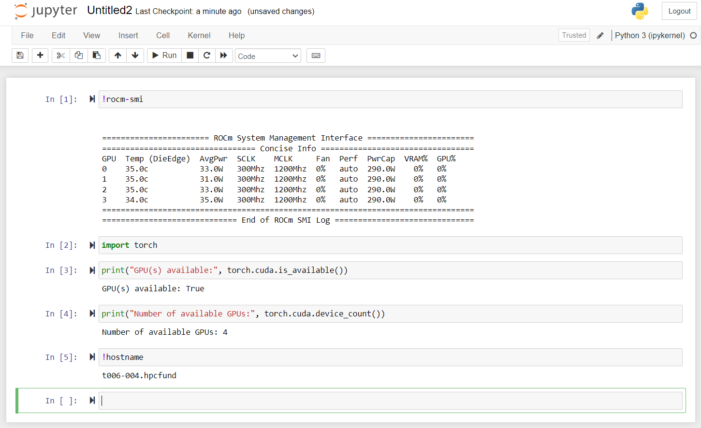

# Running Jobs

The AI & HPC Cluster runs the [SLURM](https://slurm.schedmd.com/overview.html) workload resource manager in order to organize job scheduling across the cluster. In order to access back-end compute resources, users must submit jobs to SLURM (either interactive or batch) and the underlying scheduler will manage execution of all jobs using a [multi-factor](https://slurm.schedmd.com/priority_multifactor.html) priority algorithm.

Multiple partitions (or queues) are available for users to choose from and each job submission is associated with a particular partition request.  Note that partition names are mostly organized around the type of accelerator hardware installed in the hosts. The table below summarizes available production queues, hardware configuration, allocation charging rates and runtime limits currently available:


```{table} Table 1: Available SLURM queues
:name: table-queues
| Queue     | Max Time | Max Node(s) | Charge Multiplier   |                Configuration                     | Network |
| --------- | -------- | ----------- | -----------------   | ------------------------------------------------ | :---: |
| `devel`   | 30 minutes  |      1      | {{devel_weight}}X   | Targeting short development needs (1xMI210).     | 1x&nbsp;IB&nbsp;200G |
| `mi2101x` | 12 hours |      1      | {{mi2101x_weight}}X | 1 x MI210 accelerator per node.                  | 1x&nbsp;IB&nbsp;200G |
| `mi2104x` | 24 hours |     16      | {{mi2104x_weight}}X | 4 x MI210 accelerators per node.                 | 1x&nbsp;IB&nbsp;200G |
| `mi2508x` | 12 hours |     10      | {{mi2508x_weight}}X | 4 x MI250 accelerators (8 GPUs) per node.        | 1x&nbsp;IB&nbsp;200G |
| `mi3001x` | 4 hours  |     1       | {{mi3001x_weight}}X | 1 x MI300X accelerator per node.                 | 1x&nbsp;IB&nbsp;200G |
| `mi3008x` | 12 hours (batch) <br> 4&nbsp;hours&nbsp;(interactive) |     1       | {{mi3008x_weight}}X | 8 x MI300X accelerators per node.                | 1x&nbsp;IB&nbsp;200G |
| `mi3258x` | 12 hours (batch) <br> 4&nbsp;hours&nbsp;(interactive) |     1       | {{mi3258x_weight}}X | 8 x MI325X accelerators per node.                | 1x&nbsp;IB&nbsp;200G |
| `mi3501x` | 4 hours  |     1       | {{mi3501x_weight}}X | 1 x MI350X accelerator per node.                 | 1x&nbsp;IB&nbsp;200G |
| `mi3508x` | 12 hours (batch) <br> 4&nbsp;hours&nbsp;(interactive) |     4       | {{mi3508x_weight}}X | 8 x MI350X accelerators per node.                | 8x&nbsp;RoCE&nbsp;400G |
```

Note that special requests that extend beyond the above queue limits may potentially be accommodated on a case-by-case basis. You must have an active accounting allocation in order to submit jobs and the resource manager will track the combined number of **node** hours consumed by each job and deduct the [total node hours]*[charge multiplier] from your available balance.

```{note}
The `mi3508x` partition uses RoCE networking rather than InfiniBand. Multi-node jobs on this partition require additional environment variable configuration — see [Multi-node RoCE Networking](roce-networking) for details.
```

## Offload Architecture Options

Since multiple generations of Instinct&trade; accelerators are available across the cluster, users building their own [HIP](https://rocm.docs.amd.com/projects/HIP/en/latest/) applications should include the correct target offload architecture during compilation based on the desired GPU type. The following table highlights the offload architecture types and compilation option that maps to available SLURM partitions.

```{table} Table 2: Offload architecture settings for local HIP compilation
:widths:  25 25 50
Partition Name      |  GPU Type | ROCm Offload Architecture Compile Flag
---------------|-----------|-----------------------
devel          | MI210 x 4 | `--offload-arch=gfx90a`
mi2101x        | MI210 x 1 | `--offload-arch=gfx90a`
mi2104x        | MI210 x 4 | `--offload-arch=gfx90a`
mi2508x        | MI250 x 8 | `--offload-arch=gfx90a`
mi3001x        | MI300 x 1 | `--offload-arch=gfx942`
mi3008x        | MI300 x 8 | `--offload-arch=gfx942`
mi3008x_long   | MI300 x 8 | `--offload-arch=gfx942`
mi3258x        | MI325 x 8 | `--offload-arch=gfx942`
mi3508x        | MI325 x 8 | `--offload-arch=gfx950`
```

(batch-jobs)=
## Batch job submission

Example SLURM batch job submission scripts are available on the login node at `/opt/ohpc/pub/examples/slurm`.  A basic starting job for MPI-based applications is available in this directory named `job.mpi` and is shown below for reference:

```
#!/bin/bash

#SBATCH -J test               # Job name
#SBATCH -o job.%j.out         # Name of stdout output file (%j expands to jobId)
#SBATCH -N 2                  # Total number of nodes requested
#SBATCH -n 8                  # Total number of mpi tasks requested
#SBATCH -t 01:30:00           # Run time (hh:mm:ss) - 1.5 hours
#SBATCH -p mi2104x            # Desired partition

# Launch an MPI-based executable

prun ./a.out
```

The `prun` utility included in the above job script is a wrapper script for launching MPI-based executables. To submit this batch job, issue the command: `sbatch job.mpi`.  Note that in this example, 8 MPI tasks will be launched on two physical nodes resulting in 4 MPI tasks per node. This is a fairly common use case for the `mi1004x` partition where 1 MPI task is allocated per GPU accelerator.

```{tip}
SLURM batch submission scripts are just shell scripts - you can customize the script to perform various pre and post-processing tasks in addition to launching parallel jobs.
```

(interactive-jobs)=
## Interactive usage
In addition to running batch jobs, you may also request an interactive session on one or more compute nodes.  This is convenient for longer compilations or when undertaking debugging and testing tasks where it is convenient to have access to an interactive shell.  To submit interactive jobs, the `salloc` command is used and the example below illustrates an interactive session submitted to the devel queue:

```{code-block} console
[test@login1 ~]$ salloc -N 1 -n 4 -p devel -t 00:30:00
salloc: ---------------------------------------------------------------
salloc: AMD HPC Fund Job Submission Filter
salloc: ---------------------------------------------------------------
salloc: --> ok: runtime limit specified
...
...
salloc: Granted job allocation 449
[test@t004-002 ~]$
```
When the above command is submitted on the login node, SLURM will queue the job and the prompt will temporarily hang until adequate resources are available. Once the scheduler has allocated resources,  your prompt will be updated to provide a login on the first assigned compute node. From here, you can run any shell commands until the maximum job runlimit is reached.  You can also launch parallel jobs interactively from within your allocation, for example:

```{code-block} console
[test@t004-002 ~]$ prun hostname
[prun] Master compute host = t004-002
[prun] Resource manager = slurm
[prun] Launch cmd = mpirun hostname (family=openmpi4)
t004-002.hpcfund
t004-002.hpcfund
t004-002.hpcfund
t004-002.hpcfund
```

```{tip}
To terminate an interactive job, simply type `exit` at your shell prompt.
```


## Compute node access
The AI & HPC Cluster compute nodes are allocated in an **exclusive** fashion such that only a single user is on a node at any one time and is allocated all resources associated with the host (CPUs, host memory, GPUs, etc). Consequently, ssh access to back-end compute hosts are dynamically controlled with temporary access granted for the duration of a user's job.  The `squeue` command can be used to interrogate a running job and identify assigned hosts in order to gain ssh access. For example:

```{code-block} console
[test@login1 ~]$ squeue -j 451
             JOBID PARTITION     NAME     USER ST       TIME  NODES NODELIST(REASON)
               451     devel interact     test  R       0:10      2 t004-[002-003]

[test@login1 ~]$ ssh t004-003
...
[test@t004-003 ~]$
```

## Aggregating tasks using job steps

As mentioned above, the AI & HPC Cluster compute nodes are allocated for **exclusive** usage - i.e. they are not shared amongst multiple jobs or users. Consequently, accounting charges are accrued at the node-hour level with charge multipliers highlighted in [Table 1](#table-queues).  To maximize efficiency of the consumed node hours, users are encouraged to take advantage of multiple GPU resources per node whenever possible.

If your application is only configured for single GPU acceleration, you can still take advantage of multiple GPUs by aggregating several independent tasks together to run in a single SLURM job. There are a variety of ways to do this, but we highlight an example below using job steps. In this case, the assumption is that a user has four independent, single-GPU tasks they would like to run simultaneously on a single node in order to take advantage of all GPU resources available.  An example job script named `job.launcher` demonstrating this approach is available on the system at `/opt/ohpc/pub/examples/slurm`. An example copy is shown below which requests four tasks on a compute node. Note the use of the `HIP_VISIBLE_DEVICES` environment variable to map each task to a unique GPU device.


```{code-block} bash
#!/bin/bash

#SBATCH -J launcher           # Job name
#SBATCH -o job.%j.out         # Name of stdout output file (%j expands to jobId)
#SBATCH -N 1                  # Total number of nodes requested
#SBATCH -n 4                  # Total number of mpi tasks requested
#SBATCH -t 01:30:00           # Run time (hh:mm:ss) - 1.5 hours
#SBATCH -p mi2104x            # Desired partition

binary=./hipinfo
args=""

echo "Launching 4 jobs on different GPUs..."

export HIP_VISIBLE_DEVICES=0; srun -n 1 -o output.%J.log --exact ${binary} ${args} &
export HIP_VISIBLE_DEVICES=1; srun -n 1 -o output.%J.log --exact ${binary} ${args} &
export HIP_VISIBLE_DEVICES=2; srun -n 1 -o output.%J.log --exact ${binary} ${args} &
export HIP_VISIBLE_DEVICES=3; srun -n 1 -o output.%J.log --exact ${binary} ${args} &

echo "Job steps submitted..."
sleep 1
squeue -u `id -un` -s

# Wait for all jobs to complete...
wait

echo "All Steps completed."
```

To demonstrate the multiple job launches, consider compiling a `hipinfo` utility as follows which  prints a number of architectural properties from the GPU execution device (code sample is available with ROCm installed on the system).  

```{code-block} console
[test@login1 ~]$ hipcc -o hipinfo $ROCM_DIR/share/hip/samples/1_Utils/hipInfo/hipInfo.cpp
```

Once compiled, the launcher job submission script above can be copied to your local directory and submitted via `sbatch job.launcher`.  After execution, you should have 5 output files present in the submission directory. The results of each job step are available in four "output*.log" files demarcated by the job ID and job step. For example, the output below corresponds to SLURM job=1514:

```{code-block} console
[test@login1 ~]$ ls  output.*.log
output.1514.0.log  output.1514.1.log  output.1514.2.log  output.1514.3.log
```
Because each job step targets a different GPU, the `hipinfo` utility reports details from each device separately but as the GPUs are all the same model in a given node, the majority of the reported information is identical. However, we can confirm that each job step runs on a different GPU by querying the `pciBusID`. For example, the following query confirms each step ran on a different PCI device:

```{code-block} console
[test@login1 ~]$ grep "pciBusID" output.1514.?.log
output.1514.0.log:pciBusID:                         195
output.1514.1.log:pciBusID:                         131
output.1514.2.log:pciBusID:                         227
output.1514.3.log:pciBusID:                         163
```

## Common SLURM commands

The table below highlights several of the more common user-facing SLURM commands. Consult the man pages (e.g. `man sbatch`) for more detailed information and command-line options for these utilities.

```{table} Table 3: Common SLURM commands
| Command | Purpose |
| ------- | ------- |
| sbatch  | submit a job for later execution |
| scancel | cancel (delete) a pending or running job |
| salloc  | allocate resources in real time (e.g. to request an interactive job) |
| sinfo   | report the state of partitions and nodes |
| squeue  | report the state of queue jobs |
| scontrol | view or modify a job configuration |
```

(roce-networking)=
## Multi-node RoCE Networking

Unlike other partitions which use InfiniBand, the `mi3508x` partition is equipped with 8x [RoCE](https://en.wikipedia.org/wiki/RDMA_over_Converged_Ethernet) 400G NICs per node. When running multi-GPU or multi-node workloads on this partition, users must configure the appropriate [RCCL](https://rocm.docs.amd.com/projects/rccl/en/latest/index.html) environment variables to ensure proper use of the RoCE network devices.

Each node has 8 RoCE network interfaces named `bnxt_re0` through `bnxt_re7` (one per GPU). The following Table highlights relevant environment variables for configuring RoCE network communication between GPUs using RCCL:

```{table} Table 4: RCCL environment variables for RoCE
| Variable | Value | Purpose |
| -------- | ----- | ------- |
| `NCCL_IB_HCA` | `bnxt_re0,bnxt_re1,bnxt_re2,bnxt_re3,bnxt_re4,bnxt_re5,bnxt_re6,bnxt_re7` | Specifies the RDMA network devices to use for GPU communication |
| `NCCL_NET_GDR_LEVEL` | `5` | Enables GPU Direct RDMA for direct GPU-to-NIC data transfers |
| `NCCL_IB_GID_INDEX` | `3` | Selects the correct RoCEv2 GID index |
| `NCCL_SOCKET_IFNAME` | `eth0` | Sets the network interface for out-of-band control traffic |
```

### RCCL-test

Below is an example job script that runs `all_reduce_perf` from a pre-built version of the [RCCL-test](https://github.com/ROCm/rocm-systems/tree/develop/projects/rccl-tests) benchmark across 2 nodes (16 GPUs total) on the `mi3508x` partition:

```{code-block} bash
#!/bin/bash

#SBATCH -J rccl               # Job name
#SBATCH -o rccl.%j.out        # Name of stdout output file (%j expands to jobId)
#SBATCH -N 2                  # Total number of nodes requested
#SBATCH -n 16                 # Total number of tasks requested
#SBATCH -t 00:30:00           # Run time (hh:mm:ss) - 30 minutes
#SBATCH -p mi3508x            # Desired partition

export NCCL_IB_HCA=bnxt_re0,bnxt_re1,bnxt_re2,bnxt_re3,bnxt_re4,bnxt_re5,bnxt_re6,bnxt_re7
export NCCL_NET_GDR_LEVEL=5
export NCCL_IB_GID_INDEX=3
export NCCL_SOCKET_IFNAME=eth0

# load rccl-tests module
module load rccl-tests

srun all_reduce_perf -b 8 -e 1G -f 2 -g 1
```

This script launches an `all_reduce_perf` benchmark that sweeps message sizes from 8 bytes to 1 GB (doubling at each step), using 1 GPU per task across 2 nodes.

### PyTorch Distributed

Since [PyTorch](https://pytorch.org/) also uses RCCL as its distributed communication backend on AMD GPUs, the same RoCE environment variables apply when running multi-node PyTorch workloads. The following example uses `torchrun` to launch a simple `all_reduce` benchmark across 2 nodes (16 GPUs total):

```{code-block} bash
#!/bin/bash

#SBATCH -J pytorch-bench        # Job name
#SBATCH -o pytorch-bench.%j.out # Name of stdout output file (%j expands to jobId)
#SBATCH -N 2                    # Total number of nodes requested
#SBATCH --ntasks-per-node=1     # One task per node, torchrun will spawn additional
#SBATCH -t 00:30:00             # Run time (hh:mm:ss) - 30 minutes
#SBATCH -p mi3508x              # Desired partition

module load pytorch/2.10.0

export NCCL_IB_HCA=bnxt_re0,bnxt_re1,bnxt_re2,bnxt_re3,bnxt_re4,bnxt_re5,bnxt_re6,bnxt_re7
export NCCL_NET_GDR_LEVEL=5
export NCCL_IB_GID_INDEX=3
export NCCL_SOCKET_IFNAME=eth0
export MASTER_ADDR=$(scontrol show hostnames $SLURM_JOB_NODELIST | head -n 1)
export MASTER_PORT=29500
export OMP_NUM_THREADS=1

srun torchrun \
    --nnodes=$SLURM_JOB_NUM_NODES \
    --nproc_per_node=8 \
    --rdzv_id=$SLURM_JOB_ID \
    --rdzv_backend=c10d \
    --rdzv_endpoint=$MASTER_ADDR:$MASTER_PORT \
    allreduce_bench.py
```

The `allreduce_bench.py` script referenced above performs a simple sweep of `all_reduce` operations across a range of message sizes:

```{code-block} python
import torch
import torch.distributed as dist
import os

dist.init_process_group(backend="nccl")
local_rank = int(os.environ["LOCAL_RANK"])
torch.cuda.set_device(local_rank)

for size in [2**n for n in range(20, 31)]:  # 1MB to 1GB
    tensor = torch.ones(size // 4, device="cuda")
    torch.cuda.synchronize()
    start = torch.cuda.Event(enable_timing=True)
    end = torch.cuda.Event(enable_timing=True)
    start.record()
    dist.all_reduce(tensor)
    end.record()
    torch.cuda.synchronize()
    if dist.get_rank() == 0:
        elapsed = start.elapsed_time(end) / 1000
        bw = (tensor.nbytes / 1e9) / elapsed
        print(f"Size: {tensor.nbytes/1e6:.0f} MB  BW: {bw:.2f} GB/s")

dist.destroy_process_group()
```

(jupyter)=
## Jupyter

Users can run Jupyter Notebooks on the AI & HPC Cluster compute nodes by making a copy
of the example batch script (available here:
`/opt/ohpc/pub/examples/slurm/job.notebook`) and customizing it to fit their
needs. The script can then be used by following steps 1-3 below.

**Step 1:**

While logged into the AI & HPC Cluster, make a copy of the batch script, submit
it to the batch system, and `cat` the contents of the newly-created
`job.<job-id>.out` file (where `<job-id>` is the Job ID for your batch job):

```
$ cp /opt/ohpc/pub/examples/slurm/job.notebook .


$ sbatch job.notebook
sbatch: ---------------------------------------------------------------
sbatch: AMD HPC Fund Job Submission Filter
sbatch: ---------------------------------------------------------------
sbatch: --> ok: runtime limit specified
sbatch: --> ok: using default qos
sbatch: --> ok: Billing account-> <project-id>/<username>
sbatch: --> checking job limits...
sbatch:     --> requested runlimit = 1.5 hours (ok)
sbatch: --> checking partition restrictions...
sbatch:     --> ok: partition = mi1004x
Submitted batch job <job-id>


$ cat job.<job-id>.out

------
Jupyter Notebook Setup:

To access this notebook, use a separate terminal on your laptop/workstation to create
an ssh tunnel to the login node as follows:

ssh -t hpcfund.amd.com -L 7080:localhost:<port-id>

Then, point your local web browser to http://localhost:7080 to access
the running notebook.  You will need to provide the notebook token shown below.

Please remember to Quit Jupyter when done, or "scancel" your job in SLURM job when
to avoid additional accounting charges.
-----
[I 12:36:40.651 NotebookApp] Writing notebook server cookie secret to /home1/<username>/.local/share/jupyter/runtime/notebook_cookie_secret
[I 12:36:40.936 NotebookApp] Serving notebooks from local directory: /home1/<username>
[I 12:36:40.936 NotebookApp] Jupyter Notebook 6.5.5 is running at:
[I 12:36:40.936 NotebookApp] http://localhost:8888/?token=<token-id>
[I 12:36:40.936 NotebookApp]  or http://127.0.0.1:8888/?token=<token-id>
[I 12:36:40.936 NotebookApp] Use Control-C to stop this server and shut down all kernels (twice to skip confirmation).
[C 12:36:40.939 NotebookApp]

    To access the notebook, open this file in a browser:
        file:///home1/<username>/.local/share/jupyter/runtime/nbserver-<id>-open.html
    Or copy and paste one of these URLs:
        http://localhost:8888/?token=<token-id>
     or http://127.0.0.1:8888/?token=<token-id>
```

By default, the batch script loads the `pytorch` module, launches a job on a
compute node for 1.5 hours, and creates an `ssh` tunnel from the compute node
to the login node.

```{note}
The text between the `------` lines in the `job.<job-id>.out` file is written from the batch script itself, while the rest of the text is written out from the Jupyter server. The only content needed from the Jupyter server will be the `<token-id>`, which will be used to log in in Step 3 below. The URLs pointing to `localhost:8888` can be ignored since we will be further tunneling to your local computer (i.e., laptop/desktop) in Step 2 and a different port will be used..
```

**Step 2:**

In a new terminal window, issue the `ssh` command shown in Step 1 to create a tunnel between your local computer (i.e., laptop/desktop) and the login node:

```
$ ssh -t hpcfund.amd.com -L 7080:localhost:<port-id>
```

**Step 3:**

On your local computer (i.e., laptop/desktop), open an internet browser and
navigate to [http://localhost:7080](http://localhost:7080). When prompted for a
password or token, enter the `<token-id>` printed to your `job.<job-id>.out`
file (as shown in Step 1 above). After logging in, you should be able to create
a new (or open an existing) notebook and access the GPUs on the compute node:



```{tip}
Please see the [Python Environment](python-environment) section to understand how the base Python environment and `pytorch` and `tensorflow` modules can be customized.
```
## Containers
The container platform available for use on the HPC Fund cluster is [Singularity/Apptainer](https://apptainer.org/docs/user/main/), which can (of course) use/build Singularity containers or transparently convert Docker images into the Singularity format.

```{note}
Apptainer is the new name for Singularity, so it will be referred to as Apptainer in the remainder of these docs.
```

### Simple Ubuntu example
This example shows how to use Apptainer to pull down the latest base Ubuntu container from DockerHub and run it on the cluster. Notice that the Docker container is converted to the Singularity format (SIF) transparently during the `pull`.

```
#---- PULL CONTAINER DOWN FROM DOCKERHUB ----#
$ apptainer pull docker://ubuntu
INFO:    Converting OCI blobs to SIF format
INFO:    Starting build...
Getting image source signatures
Copying blob 445a6a12be2b done
Copying config c6b84b685f done
Writing manifest to image destination
Storing signatures
2023/09/21 08:39:13  info unpack layer: sha256:445a6a12be2be54b4da18d7c77d4a41bc4746bc422f1f4325a60ff4fc7ea2e5d
INFO:    Creating SIF file...


#---- RUN CONTAINER ----#
$ apptainer run ubuntu_latest.sif


#---- (INSIDE CONTAINER) PRINT OS DETAILS ----#
Apptainer> cat /etc/os-release
PRETTY_NAME="Ubuntu 22.04.3 LTS"
NAME="Ubuntu"
VERSION_ID="22.04"
VERSION="22.04.3 LTS (Jammy Jellyfish)"
VERSION_CODENAME=jammy
ID=ubuntu
ID_LIKE=debian
HOME_URL="https://www.ubuntu.com/"
SUPPORT_URL="https://help.ubuntu.com/"
BUG_REPORT_URL="https://bugs.launchpad.net/ubuntu/"
PRIVACY_POLICY_URL="https://www.ubuntu.com/legal/terms-and-policies/privacy-policy"
UBUNTU_CODENAME=jammy
```
### ROCm-Enabled PyTorch example
This example shows how to use Apptainer to pull down the latest ROCm-enabled PyTorch container from DockerHub and run it on the cluster.

```{note}
This container is much larger (~13 GB) than the Ubuntu container (~29 MB) so it should be run on a compute node from your project `$WORK` directory.

* Project `$WORK` directories have a larger quota (2 TB shared among all users of the project), whereas user `$HOME` directories only have a quota of 25 GB.

* A compute node is needed to avoid running out of shared resources on the login node while pulling down the container.
```

```
#---- GRAB A COMPUTE NODE IN AN INTERACTIVE JOB ----#
$ salloc -A <project_id> -N 1 -t 60 -p mi1004x
salloc: ---------------------------------------------------------------
salloc: AMD HPC Fund Job Submission Filter
salloc: ---------------------------------------------------------------
salloc: --> ok: runtime limit specified
salloc: --> ok: using default qos
salloc: --> ok: Billing account-> <project_id>/<username>
salloc: --> checking job limits...
salloc:     --> requested runlimit = 1.0 hours (ok)
salloc: --> checking partition restrictions...
salloc:     --> ok: partition = mi1004x
salloc: Granted job allocation <job-id>


#---- PULL DOWN CONTAINER FROM GITHUB ----#
$ apptainer pull docker://rocm/pytorch:latest
INFO:    Converting OCI blobs to SIF format
INFO:    Starting build...
Getting image source signatures
...
...
INFO:    Creating SIF file...


#---- RUN THE CONTAINER ----#
$ apptainer run pytorch_latest.sif


#---- (INSIDE CONTAINER) CHECK FOR GPUS ----#
Apptainer> rocm-smi
========================= ROCm System Management Interface =========================
=================================== Concise Info ===================================
GPU  Temp (DieEdge)  AvgPwr  SCLK    MCLK     Fan  Perf  PwrCap  VRAM%  GPU%
0    35.0c           34.0W   300Mhz  1200Mhz  0%   auto  290.0W    0%   0%
1    36.0c           34.0W   300Mhz  1200Mhz  0%   auto  290.0W    0%   0%
2    34.0c           30.0W   300Mhz  1200Mhz  0%   auto  290.0W    0%   0%
3    34.0c           32.0W   300Mhz  1200Mhz  0%   auto  290.0W    0%   0%
====================================================================================
=============================== End of ROCm SMI Log ================================


#---- (INSIDE CONTAINER) CHECK GPU INFO ----#
Apptainer> rocminfo | head
ROCk module is loaded
=====================
HSA System Attributes
=====================
Runtime Version:         1.1
System Timestamp Freq.:  1000.000000MHz
Sig. Max Wait Duration:  18446744073709551615 (0xFFFFFFFFFFFFFFFF) (timestamp count)
Machine Model:           LARGE
System Endianness:       LITTLE


#---- (INSIDE CONTAINER) LAUNCH A PYTHON SHELL ----#
Apptainer> python3
Python 3.8.16 (default, Jun 12 2023, 18:09:05)
[GCC 11.2.0] :: Anaconda, Inc. on linux
Type "help", "copyright", "credits" or "license" for more information.


#---- (INSIDE CONTAINER) IMPORT PYTORCH ----#
>>> import torch


#---- (INSIDE CONTAINER) CHECK OF ROCM IS AVAILABLE ----#
>>> print("GPU(s) available:", torch.cuda.is_available())
GPU(s) available: True


#---- (INSIDE CONTAINER) CHECK NUMBER OF GPUS ----#
>>> print("Number of available GPUs:", torch.cuda.device_count())
Number of available GPUs: 4
```

```{note}
* PyTorch uses `cuda` even when targeting ROCm devices.
* By default, your `$HOME` and `$WORK` directories are bind-mounted into the container.
```

### ROCm-enabled TensorFlow example
This example shows how to use Apptainer to pull down the latest ROCm-enabled TensorFlow container from DockerHub and run it on the cluster.

```{note}
Similar to the PyTorch container above, this container is much larger (~11 GB) than the Ubuntu container (~29 MB) so it should be run on a compute node from your project `$WORK` directory.

* Project `$WORK` directories have a larger quota (2 TB shared among all users of the project), whereas user `$HOME` directories only have a quota of 25 GB.

* A compute node is needed to avoid running out of shared resources on the login node while pulling down the container.
```

```
#---- GRAB A COMPUTE NODE IN AN INTERACTIVE JOB ----#
$ salloc -A <project_id> -N 1 -t 60 -p mi1004x
salloc: ---------------------------------------------------------------
salloc: AMD HPC Fund Job Submission Filter
salloc: ---------------------------------------------------------------
salloc: --> ok: runtime limit specified
salloc: --> ok: using default qos
salloc: --> ok: Billing account-> <project_id>/<username>
salloc: --> checking job limits...
salloc:     --> requested runlimit = 1.0 hours (ok)
salloc: --> checking partition restrictions...
salloc:     --> ok: partition = mi1004x
salloc: Granted job allocation <job-id>


#---- PULL DOWN CONTAINER FROM GITHUB ----#
$ apptainer pull docker://rocm/tensorflow:latest
INFO:    Converting OCI blobs to SIF format
INFO:    Starting build...
Getting image source signatures
...
...
INFO:    Creating SIF file...


#---- RUN THE CONTAINER - SEE NOTE BELOW FOR ADDITIONAL FLAGS ----#
$ apptainer run  --containall --bind=${HOME},${WORK},/dev/kfd,/dev/dri tensorflow_latest.sif


#---- (INSIDE CONTAINER) CHECK FOR GPUS ----#
Apptainer> rocm-smi
========================= ROCm System Management Interface =========================
=================================== Concise Info ===================================
GPU  Temp (DieEdge)  AvgPwr  SCLK    MCLK     Fan  Perf  PwrCap  VRAM%  GPU%
0    35.0c           34.0W   300Mhz  1200Mhz  0%   auto  290.0W    0%   0%
1    35.0c           34.0W   300Mhz  1200Mhz  0%   auto  290.0W    0%   0%
2    34.0c           30.0W   300Mhz  1200Mhz  0%   auto  290.0W    0%   0%
3    34.0c           32.0W   300Mhz  1200Mhz  0%   auto  290.0W    0%   0%
====================================================================================
=============================== End of ROCm SMI Log ================================


#---- (INSIDE CONTAINER) CHECK GPU INFO ----#
Apptainer> rocminfo | head
ROCk module is loaded
=====================
HSA System Attributes
=====================
Runtime Version:         1.1
System Timestamp Freq.:  1000.000000MHz
Sig. Max Wait Duration:  18446744073709551615 (0xFFFFFFFFFFFFFFFF) (timestamp count)
Machine Model:           LARGE
System Endianness:       LITTLE


#---- (INSIDE CONTAINER) LAUNCH A PYTHON SHELL ----#
Apptainer> python3
Python 3.9.17 (main, Jun  6 2023, 20:11:04)
[GCC 9.4.0] on linux
Type "help", "copyright", "credits" or "license" for more information.


#---- (INSIDE CONTAINER) IMPORT PYTORCH ----#
>>> import tensorflow as tf
2023-09-21 09:57:29.569788: I tensorflow/core/platform/cpu_feature_guard.cc:193] This TensorFlow binary is optimized with oneAPI Deep Neural Network Library (oneDNN) to use the following CPU instructions in performance-critical operations:  SSE3 SSE4.1 SSE4.2 AVX AVX2 FMA
To enable them in other operations, rebuild TensorFlow with the appropriate compiler flags.


#---- (INSIDE CONTAINER) CHECK NUMBER OF GPUS ----#
>>> gpu_list = tf.config.list_physical_devices('GPU')
>>> for gpu in gpu_list:
...     print(gpu)
...
PhysicalDevice(name='/physical_device:GPU:0', device_type='GPU')
PhysicalDevice(name='/physical_device:GPU:1', device_type='GPU')
PhysicalDevice(name='/physical_device:GPU:2', device_type='GPU')
PhysicalDevice(name='/physical_device:GPU:3', device_type='GPU')
```

```{note}
By default, Apptainer will bring environment variables from the host (i.e., compute node) environment into the container. Unlike the PyTorch container above, this TensorFlow container does not appear to set some environment variables (e.g., `LANG`), so the values from the host environment are still set - which can cause some warnings about `hipcc`. 

To resolve this, the `--containall` flag was used to ensure nothing from the host environment gets brought in. This means we need to manually bind-mount some important directories; `/dev/kfd` and `/dev/dri` so the ROCm driver can collect information about the GPUs, and also the `$HOME` and `$WORK` directories. 
```

### Extending Docker containers with Apptainer
If users need to build on top of existing containers (e.g., installing additional packages), they can do so with Apptainer definition files. For example, the following definition file can be used to build a container with an upgraded `scipy` and newly-installed `pandas` package using the ROCm-enabled PyTorch container as a starting point. It also sets an environment variable inside the container.

```
#---- CUSTOMIZED APPTAINER DEFINITION FILE ----#
$ cat rocm_pt.def
Bootstrap: docker
From: rocm/pytorch:latest

%environment
export MY_ENV_VAR="This is my environment variable"

%post
    pip3 install --upgrade pip
    pip3 install scipy --upgrade
    pip3 install pandas


#---- BUILD CUSTOMIZED CONTAINER ----#
$ apptainer build rocm_pt.sif rocm_pt.def
...
...
Successfully installed numpy-1.24.4 scipy-1.10.1
...
Successfully installed pandas-2.0.3 pytz-2023.3.post1 tzdata-2023.3
...
INFO:    Adding environment to container
INFO:    Creating SIF file...
INFO:    Build complete: rocm_pt.sif


#---- RUN THE CONTAINER ----#
$ apptainer run rocm_pt.sif


#---- (INSIDE CONTAINER) PRINT ENVIRONMENT VARIABLE ----#
Apptainer> echo $MY_ENV_VAR
This is my environment variable


#---- (INSIDE CONTAINER) CHECK IF PANDAS IS INSTALLED ----#
Apptainer> pip list | grep pandas
pandas                  2.0.3


#---- (INSIDE CONTAINER) LAUNCH A PYTHON SHELL ----#
Apptainer> python3
Python 3.8.16 (default, Jun 12 2023, 18:09:05)
[GCC 11.2.0] :: Anaconda, Inc. on linux
Type "help", "copyright", "credits" or "license" for more information.


#---- (INSIDE CONTAINER) IMPORT PANDAS ----#
>>> import pandas as pd


#---- (INSIDE CONTAINER) SHOW PANDAS WORKING ----#
>>> data = {
...     "numbers" : [2, 4, 6],
...     "letters" : ['b', 'd', 'f']
... }


>>> df = pd.DataFrame(data)


>>> print(df)
   numbers letters
0        2       b
1        4       d
2        6       f
```

As we can see the `pandas` package is now available inside the container, and the ROCm and TensorFlow functionality still works as before.

For more detailed information on using Apptainer definition files, please see [this section](https://apptainer.org/docs/user/main/definition_files.html) of the Apptainer user docs.


## Large Language Models (Ollama)

Users can experiment with open-weight models running on GPUs with [Ollama](https://ollama.com/). Ollama is a popular framework that enables easy interaction with Large Language Models (LLMs), and it uses [llama.cpp](https://github.com/ggerganov/llama.cpp) as a backend.

It is easiest to run these steps from a JupyterLab environment (as outlined in the [Jupyter](#jupyter) section) since that allows you to spawn multiple terminal windows and one can be dedicated to the Ollama server, however you can do all this from an interactive session just as well.

**Step 0:**

Grab a compute node in an interactive session.

```{note}
Remember that the login node is NOT meant for compute-intensive tasks like serving LLMs, so please make sure to allocate a compute node to follow along with this section.
```

```bash
salloc -N <number-of-nodes> -t <walltime> -p <partition>
```

**Step 1:**

Download and extract the Ollama packages and start the server.

```bash
mkdir <my-ollama-dir>
cd <my-ollama-dir>

curl -LO https://ollama.com/download/ollama-linux-amd64.tgz
tar -xzvf ollama-linux-amd64.tgz

curl -LO https://ollama.com/download/ollama-linux-amd64-rocm.tgz
tar -xzvf ollama-linux-amd64-rocm.tgz
```

If you are comfortable creating multiple terminal sessions on the same compute node, then simply run the serve command and open up a new terminal session on the same node to interact with the server.
```bash
OLLAMA_MODELS=<path-to-store-models> ./bin/ollama serve
```

Otherwise you can run the server in the background with optional logging as follows:
```bash
OLLAMA_MODELS=<path-to-store-models> ./bin/ollama serve 2>&1 | tee log > /dev/null &
```

```{note}
By default, the models downloaded in Step 2 below will be saved in `~/.ollama`. However, your `$HOME` directory only has a storage capacity of 25GB and so can quickly fill up with larger models. Therefore, we recommend using the `OLLAMA_MODELS` environment variable to change the directory where the models are saved to a location within your `$WORK` directory, which has a much larger capacity.
```

**Step 2:**

Ollama hosts a list of open-weight models available on their [site](https://ollama.com/library). In this example we will pull in the Llama3.1 8B model -- one of the most popular open-weight models released by [Meta](https://llama.meta.com/llama3/).

```bash
./bin/ollama pull llama3.1:8b
```

As described in Step 1, these models will be saved in the directory specified by using the `OLLAMA_MODELS` environment variable.

**Step 3:**

The Ollama server is OpenAI API compatible and uses port **11434** by default. This means we can send requests, much like outlined in the [OpenAI API reference documentation](https://platform.openai.com/docs/api-reference/making-requests) using curl.

```bash
curl http://localhost:11434/v1/chat/completions -H "Content-Type: application/json" \
        -d '{
        "model": "llama3.1:8b",
        "messages": [
            {
                "role": "system",
                "content": "You are a helpful and very concise assistant."
            },
            {
                "role": "user",
                "content": "Why did the chicken cross the road?"
            }
        ]
    }'
```

Response:
```bash
{"id":"chatcmpl-331","object":"chat.completion","created":1761150510,"model":"llama3.1:8b","system_fingerprint":"fp_ollama","choices":[{"index":0,"message":{"role":"assistant","content":"Classic joke! The answer is: \"To get to the other side!\" Would you like a more creative or humorous take on it, though?"},"finish_reason":"stop"}],"usage":{"prompt_tokens":32,"completion_tokens":30,"total_tokens":62}}
```

Similarly, in Python, one can use the OpenAI Python package to interface with the Ollama server. To do so, you will first need to install the `openai` package in your user install directory or within a Python virtual environment.


```bash
pip3 install openai
```

Now you can use the Python OpenAI client to invoke your locally run Llama3 model.

```python
from openai import OpenAI
client = OpenAI(base_url="http://localhost:11434/v1", api_key="none")
response = client.chat.completions.create(
    model="llama3.1:8b",
    messages=[{"role": "user", "content": "Hello this is a test"}],
)
print(response)
```

Response:
```
ChatCompletion(id='chatcmpl-782', choices=[Choice(finish_reason='stop', index=0, logprobs=None, message=ChatCompletionMessage(content='This conversation just started, so no messages have been sent yet. What would you like to talk about or practice with me?', refusal=None, role='assistant', annotations=None, audio=None, function_call=None, tool_calls=None))], created=1761150781, model='llama3.1:8b', object='chat.completion', service_tier=None, system_fingerprint='fp_ollama', usage=CompletionUsage(completion_tokens=26, prompt_tokens=15, total_tokens=41, completion_tokens_details=None, prompt_tokens_details=None))
```

**Step 4:**

Shutting down the Ollama server.

When your Slurm jobs ends (whether due to reaching walltime limit or manually canceling with `scancel <jobid>`), all user processes (including the Ollama server) will be cleaned up before putting the node back into the queue. However, if you need or want to manually shut down the server, you can do so multiple different ways. Here, we'll show only two of these ways.

Recall that for our example we used an `&` to put our Ollama serve process in the background in Step 1 so we could continue using the same terminal to further interact with the server. Therefore, we need to find that background process that is running the server so we can shut it down.

Option 1: `ps` + `kill`
```bash
ps -ef | grep "ollama serve"  # Look for the PID associated with this command in the results
kill -9 <PID>                 # Kill the process 
```

Option 2: `jobs` + `fg`
```bash
jobs                          # This will show your background processes labeled as [1], [2], etc.
fg <id>                       # Bring the process back to the foreground. E.g., `fg 1`
                              # Then simply give the Ctrl+C command to stop the process
```


<!---
## Job dependencies (TODO)
-->
